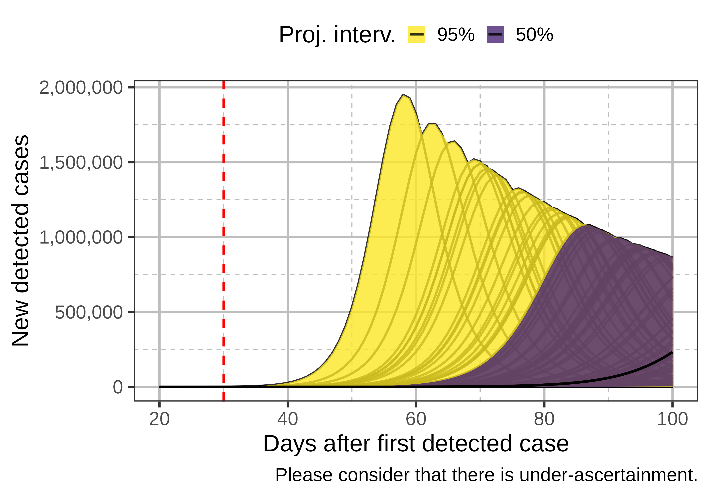
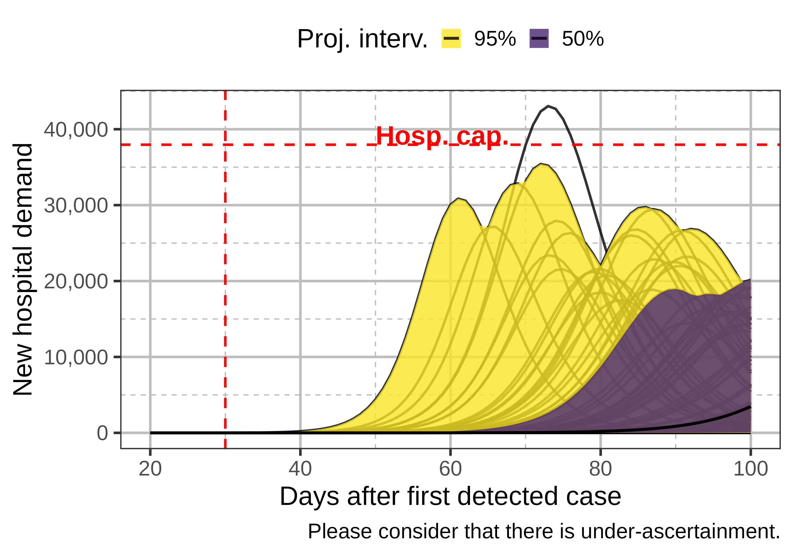
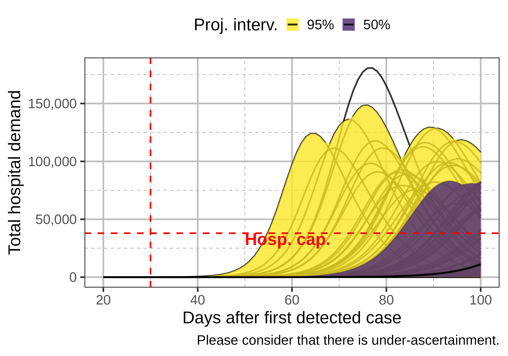
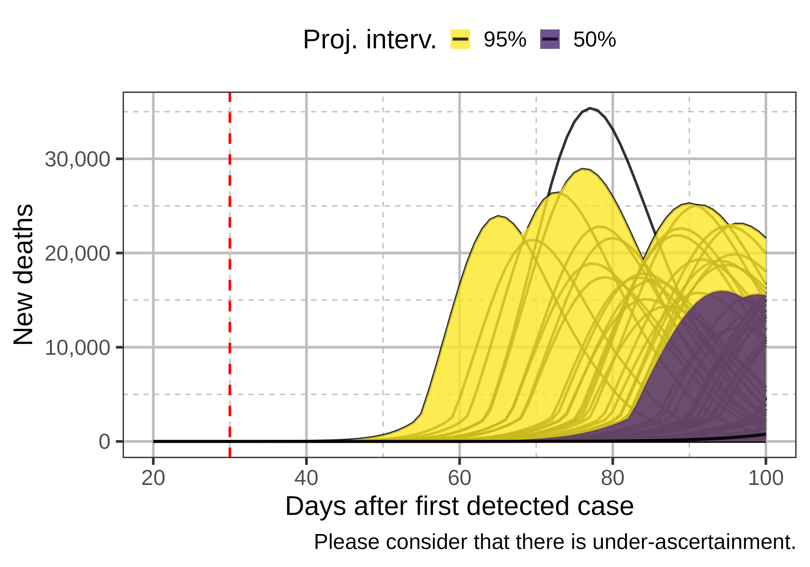
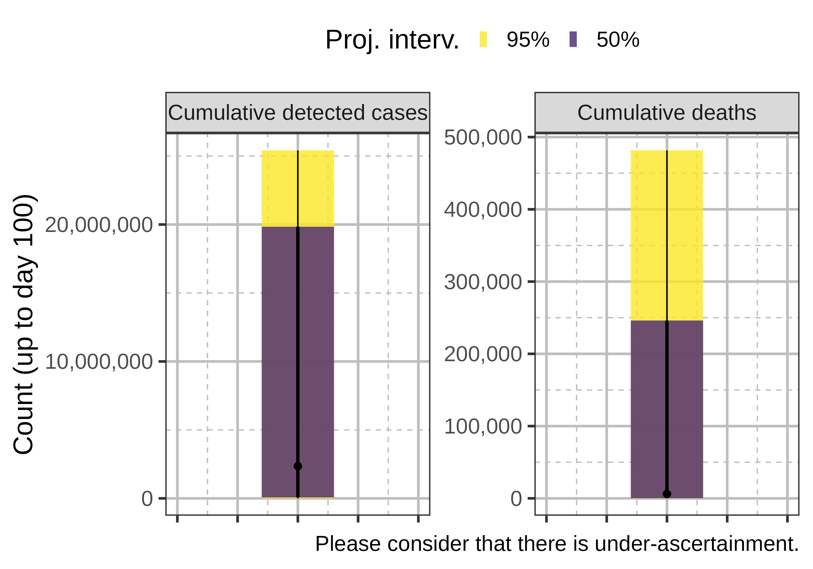
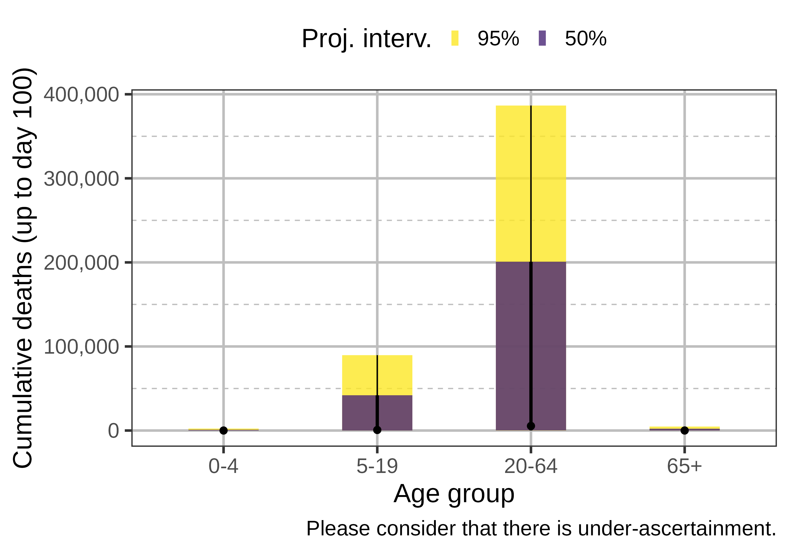
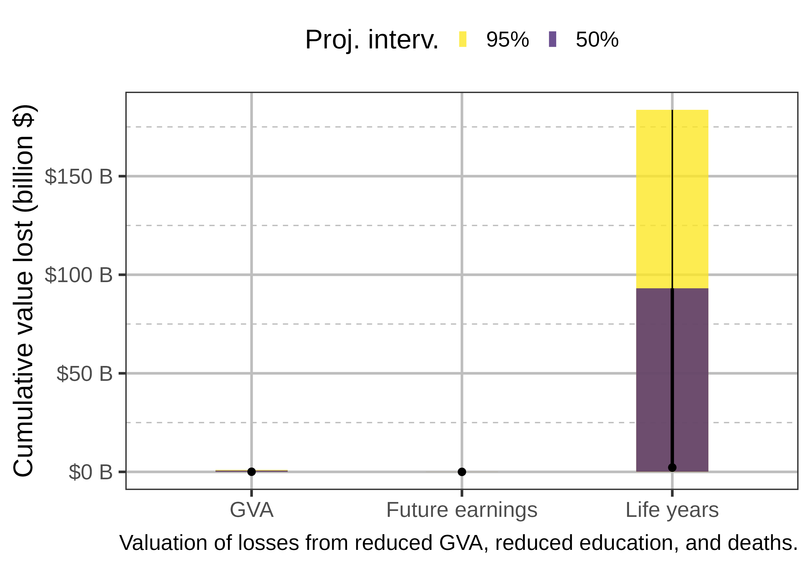

# Introduction

## Setting the scene

- You are based in South-East Asia
- Your recommendations shape regional pandemic response
- An outbreak has occurred, and you must respond
- Your analysts have delivered this set of projections to aid your decisions

# Outbreak projections

Projected outcomes if you do nothing...

## Projection: Daily new detected cases

## Projection: Daily new hospital demand (admissions)

## Projection: Total hospital demand (occupancy)

## Projection: Daily deaths

## Projection: Total cases and deaths (60 days)

## Projection: Deaths by age group (60 days)

## Projection: Economic losses (60 days)

